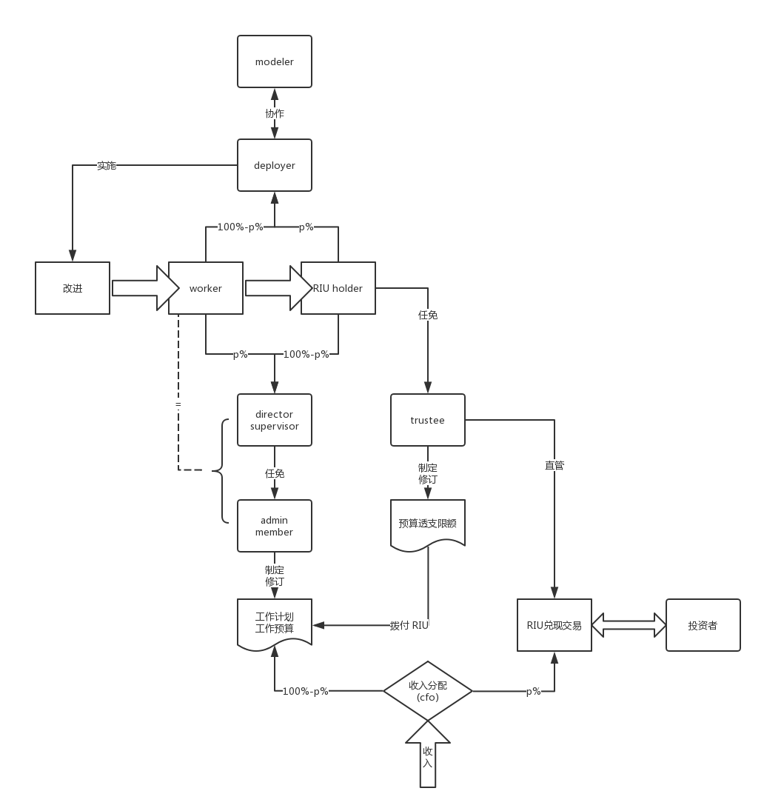

## 1609

1. 把股东的权力和利益剥离。权力归部署者，利益归受托者。
1. 部署者有两种观点：
    * 共同体的孕育者：共同体瘫痪时，以个体代替共同体一一签订合同，约定在角色完整后切换为共同体，并承担此过程的损失。
    * 共同体的重构者：共同体瘫痪时，直接以指令改造核心架构。
1. 这版草稿设计思路接近重构者，但不是直接指令而是草案，需要决策者和受托者同意才重构。原因是共同体瘫痪的判定条件不好界定，各共同体的部署者设计好之后重构一次，即可改为条件触发→直接指令。

