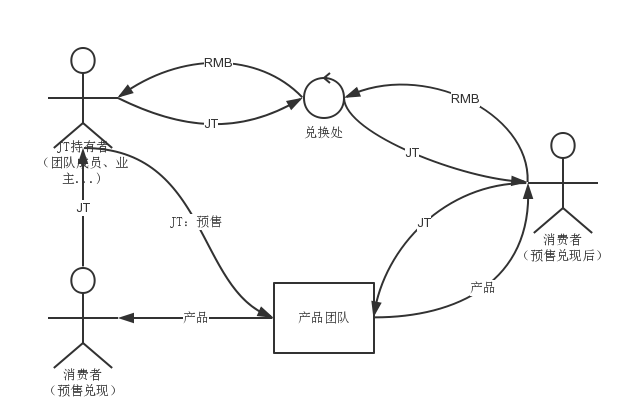

##Project Proposal
联合孵化器

###现存问题
1. 传统孵化器以房租减免（政府补贴）、房租入股等方式降低创业团队的启动成本，存在以下缺点：
	* 对团队内部的制度设计和决策、治理缺乏有效辅导。
	* 入驻团队之间很少协作，缺乏有效的交流途径和资源流动机制。
	* 退出时机少，风险高。
	* 选项程序和人员薄弱，准确率低。
2. 创业团队主要以多轮股权融资为主，存在以下缺点：
	* 非现金投入（比如管理、技术、市场）的成员，股份数额难以确定。
	* 股权跟随贡献分布调整的成本高、难度大。
	* 决策权与分配权绑定，拉低决策质量。
3. 针对传统行业设计的公司制度与新兴的IT行业之间，存在深刻的矛盾。大量成熟的专业人员被约束在行业底端，已经创业的团队也难以安心地持续改进产品。

###解决方案
1. 为不同阶段的创业团队提供内部制度设计，核心职权建模和管理软件开发等辅导：
	* 筹备（合同）：发起人开始召集团队，同时进行一些早期工作。
	* 早期（合同+企业）：正式发布前的demo、融资、开发和销售准备，可以使用多方合同或工商注册的企业两种形态。
	* 成熟（企业）：正式产品发布后，以正规企业形式运行。（未来会增设合同模式）
2. 创业团队的核心职权：
	* 在严格的监督和奖惩下运行；
	* 权利分配跟随贡献分布而调整；
	* 可以在[合同<->企业]等形式间进行等效切换。
3. 提供不同团队在融资、销售、招募的合作机制。参与团队的产品及内部管理软件均植入这些机制。
4. 基于以上机制，改造传统孵化器的工作接口，包括：投资、工作场地、生活设施等，帮助创业团队成长。
	* 投资回报的优先级提高：从资金流末端的利润分配，提升到产品销售入口。
	* 团队互相担保：投资者可以指定产品，也可以不指定。不指定的可以借助所有团队的产品销售获利。
	* 联合销售网络：参与团队的软件产品共享一个广告+信用网络，互相促进销售。

###项目目标
1. 第一年：借助少量入驻团队，完成软件与实体的磨合，形成稳定的软件接口。
2. 第二年：模式和软件接口向投融资方向延伸，吸引一批投资者入驻。
3. 第三年：整合入驻团队的人员、销售网络，开始行程规模效应，与其它孵化器拉开距离。
4. 长期：规划未来模式，跨出已有孵化园区，适应创业团队更深层次的需求。

###工作内容
1. 安博：
	1. 划出一定工作区和配套服务，供项目组和入住团队使用；
	2. 接受入驻团队以联合提货权购买以上服务；
	3. 协助创业团队办理工商、税务等政府部门的手续。
2. 学门：
	1. 根据安博的规章制度，起草合作项目内部管理制度，以及对入驻团队的协议；
	2. 配合申请入驻团队在产品中植入联合提货权所需的代码和法律条款；
	3. 帮助入驻创业团队建立内部治理结构，使团队成员的个人利益与联合提货权兑现捆绑，从而也锁定了孵化园的利益；
	4. 针对现有的天使投资人、创业圈推广联合孵化园，帮助他们通过联合孵化园的推广和招生、投资中获利。
3. 入驻团队：
	1. 在产品中植入联合提货权相关的代码和法律条款；
	2. 在正式产品销售额超过支付给安博、学门或联合企业的总数额1.5倍前，只接受联合提货权购买。

###SWOT
1. 优势：
	* 融资成本低
	* 投资风险低
	* 管理、决策质量高
	* （长期目标）创投、产销都不受过节约束，直接孵化全球级别的创业团队。
2. 劣势：
	* 学习成本高
	* 地理位置
	* 对团队领头人要求高（诚信度、透明度）
	* 项目需要边实施边完善，周期可能长
3. 机遇：
	* 创业形势比较好
	* 传统创投关系的局限开始显露
	* 传统企业制度的局限开始显露
	* 跨国运营的产品逐渐成为主流
4. 挑战：
	* 来自DAC（分布式自治系统）竞争
	* 老制度企业的反扑
	* 政策风险

