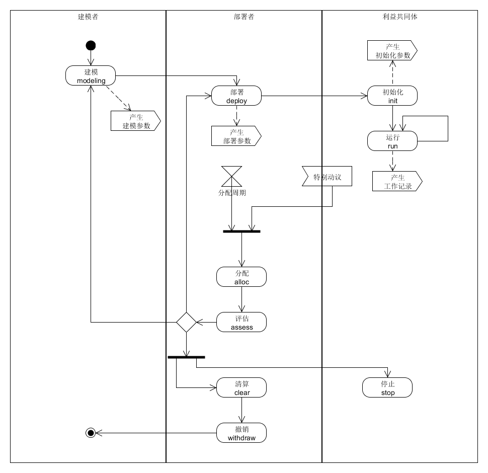

##原型1406

 
###适用范围
1. 利益共同体创办者不需要具备建模能力。
2. 利益共同体创办者无法确定建模者报酬。

 
###预期后果(描述不运用该方法干预的后果)
1. 创办者不能根据利益共同体的需要建立模型，而且倾向于隐瞒这点。
2. 创办者不能明确建模者的权利，导致建模者无法参与。
3. 利益共同体没有明确的统一模型，无法建立持续的发展规划，各局部根据一时一事的需要竞争资源。由于资源竞争干扰了执行过程，出现损失时无法确定责任。

 
###原型(方法详细描述) 
####角色清单
1. 建模者
2. 部署者
3. 项目总监
4. 立项者

####资产清单
1. 货币
2. 其它资产
	1. 提货权（如果结合提货权机制，该机制将单独整理资料。）
	2. 固定资产（根据实际情况列出）
3. 信息资产
	1. COM许可证
	2. COM建模参数
	3. COD部署方案
	4. COD部署参数
	5. 成员名录及初始化参数
	6. COD评估结果
	7. 工作计划（根据实际情况分级分类列出）
	8. 工作记录
	9. 工作报告
	10. 立项申请
	11. 立项审议意见

####任务清单
1. 建模：设计
2. 建模：升级
3. 部署
4. 初始化
5. 运行
6. 评估
7. 清算和撤销
8. 立项
	
####协作过程

附图1

1. 建模：设计
	1. 建模者分析需求，根据本原型设计COM。补充以下内容：
		- 增补角色、资产、任务。
		- 分解“运行”部分协作过程。
		- 列出工作记录的种类、内容及采集方法。
		- 明确分配规则。
		- 明确清算和撤销协作过程。
		- COM建模参数：具体数额根据模型复杂程度决定本模型每次升级、每运行一年的报酬，以及付费方式。
	2. 建模者发布COM以及《COM许可证》、《COM建模参数》。 

2. 建模：升级
	1. 建模者根据遵守《COM许可证》的COD评估结果，修改COM以及《COM许可证》、《COM建模参数》。
	2. 建模者通知注册的部署者，协助他们部署。

3. 部署
	1. 利益共同体创办者接受《COM许可证》、《COM建模参数》，向建模者注册并获得COM使用权，成为部署者。
	2. 部署者制定《COD部署方案》，明确：
		- 明确COM各部分采用何种方式实现。
		- 选择采用企业或社团等方式的部分，按照法规办理设立手续。
		- 选择采用合同实现的部分，编写合同模板。
		- 选择采用软件实现的部分，编写软件并部署运行。
		- 明确各种工作记录的具体形式。
		- 确定各任务的保底责任，即没有成员主动承担时的默认承担者。
	3. 部署者确定《COD部署参数》，其中包括立项申请的自备金比率。
	4. 进入初始化。

4. 初始化
	1. 部署者产生COD的各角色成员。
	2. 各成员根据角色定义，明确各自的初始化参数。
	3. 部署者或其授权代表整理完成《成员名录及初始化参数》。
	4. 进入运行

5. 运行（建模者在COM中分解细化）
	
6. 评估
	1. 部署者或其授权代表分析工作记录，判定COD是否按照COM运行，并明确选择：
		- COD继续运行。
		- COD重新部署。
		- COM升级。
		- COD撤销。
	2. COD继续运行：公布结果后无需其它工作。
	3. COD重新部署：
		1. 部署者确定重新部署期间的工作安排。
		2. 重新进行部署、初始化任务。
		3. 发布新版本的《COD部署方案》、《COD部署参数》、《成员名录及初始化参数》。
		4. 进入运行
	4. COM升级：进入建模:升级
	5. COD撤销：
		1. 部署者通知各成员停止工作。
		2. 部署者主持清算和撤销。
		3. 部署者通知建模者，该COD已撤销。

7. 清算和撤销（建模者在COM中分解细化）
8. 立项
	1. 立项者提交《立项申请》，并按照其中预算总额乘以“自备金比率比率”提交自备金。
	2. 项目总监组织审议，提交《立项审议意见》。
	3. 如果审议驳回，自备金返回给理想者；如果审议通过，自备金自动进入项目预算，其余预算由COD拨付。需要时可以规定里程碑审议和失败的处理。
	4. 项目收益的分配规则中，立项者获得比率应明显超过自备金比率。具体倍数是部署参数。
	5. 当项目超预算时，超出部分由项目总监决定分担方式。如立项者无法承担则失去项目管理权以及收益。

####分配规则（建模者在COM中分解细化）
#####设计思路
1. 分配规则有两种形式：
	1. 数学方程： 用数学语言明确定义的方程（组），代入建模参数、部署参数、工作记录即可计算分配结果。
	2. 人工裁量：通过人工讨论、谈判、选举、表决的过程决定分配结果。不使用工作记录而是采用人工方式评估贡献的，即使评估结果代入方程计算也属于人工裁量。
2. 两种形式都可以有多个步骤。各步骤形式不同的，可以最后一个步骤的形式为准。
3. 分配的关键时间有两种：
	1. 协作前：初始化或更早定义方程或者完成人工裁量。
	2. 协作后：在初始化之后确定方程或者进行人工裁量。
 
4. 两种形式、两个关键时间组合可以形成四种常见分配模式：
	<table>
	<tr><th rowspan="2"colspan="2">表1</th><th colspan="2">关键时间</th></tr>
	<tr><th>协作前</th><th>协作后</th></tr>
	<tr><th rowspan="2">形式</th><th>数学方程</th><td>期初方程</td><td>期末方程</td></tr>
	<tr><th>人工裁量</th><td>期初裁量</td><td>期末裁量</td></tr>
	</table>

5. 分配深度（仅供参考，将单独整理资料。）
	1. 成员M1的收益P(M1)=f1（分配总额，L1）
	2. 成员M1的收益P(M1)=f1（分配总额，L1，f2（工作记录，L2））
	3. 成员M1的收益P(M1)=f1（分配总额，L1，f2（工作记录，L2，f3（工作记录，L3）））
	4. 如此类推。其中f1、f2、f3是各深度的分配方程，L1、L2、L3是各深度的参数集合。

 
###成本分析
1. 建模者需要约一周时间调研，一周时间设计初稿。
2. 部署者设计COD部署方案：如果选择部署为企业，大约需要一个月至一个季度左右的时间。如果选择部署为多方合同，大约需要两周时间。
3. 以上工作的差旅、设备、设施等成本，根据实际工作场所与业务调研需要决定。
4. 采用软件实现的部分，根据实际需求评估成本。

 
###效果分析
1. 创办人作为部署者，与建模者的关系内置在COM模型中。建模者与部署者的权责明晰，合法。
2. 部署者获得持续的COM设计和升级服务，利益共同体在明确公开的模型下运行。

###道德声明
1. 本文内容属于作者的工作成果。
2. 本文署名无争议。
3. 引用他人的公开成果已注明出处；未引用他人的未公开成果。
4. 一旦发现作者有违反此声明的行为，俱乐部有权视情节严重性给予公开惩罚。

###附件
1. [附图1的Umlet源文件](huangyg.2001.att.1.uxf)